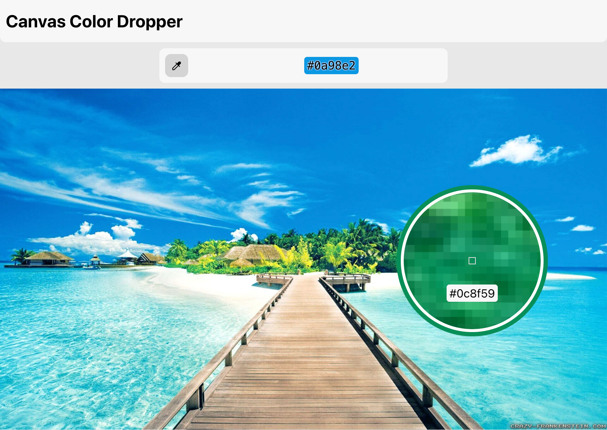

# Canvas Color Dropper

Color Dropper is a powerful tool for picking colors from an image. It's a part of a photo editor based on web
technologies, designed to allow users to easily select and identify colors in any image.



## Features

- **Color Picking**: Hover over an image to see the hex code for the color under the cursor. Click to select that color.
- **Magnification**: A magnifier follows the cursor on the canvas, allowing for precise color selection.
- **Retina Display Support**: Optimized for various `devicePixelRatio`, ensuring a crisp and clear display.
- **Performance**: Utilizes efficient rendering and offscreen canvases to provide a smooth user experience.
- **Responsive**: The canvas automatically resizes to fit the browser window, preserving the aspect ratio of the image.

## Installation

You can clone this repository using:

```bash
git clone https://github.com/artembert/canvas-color-dropper.git
cd canvas-color-dropper
```

Then install the dependencies:

```bash
npm install
```

## Usage

You can start the development server with:

```bash
npm start
```

To build a production-ready version of the project:

```bash
npm run build
```

## How to Use

1. **Select the Dropper Tool**: Click the dropper icon to enable the color picker.
2. **Hover Over the Image**: A magnifier will follow your cursor, showing a close-up view of the part of the image under
   the cursor. The hex code for the color will also be displayed.
3. **Click to Select**: Click on the desired color to select it. The selected color's hex code will be displayed in the
   header.

## Technical Details

The project makes extensive use of the HTML5 Canvas API, React, and TypeScript. It handles large images up to 16 MB (
4000x4000 pixels) and is optimized for performance with features like offscreen rendering.